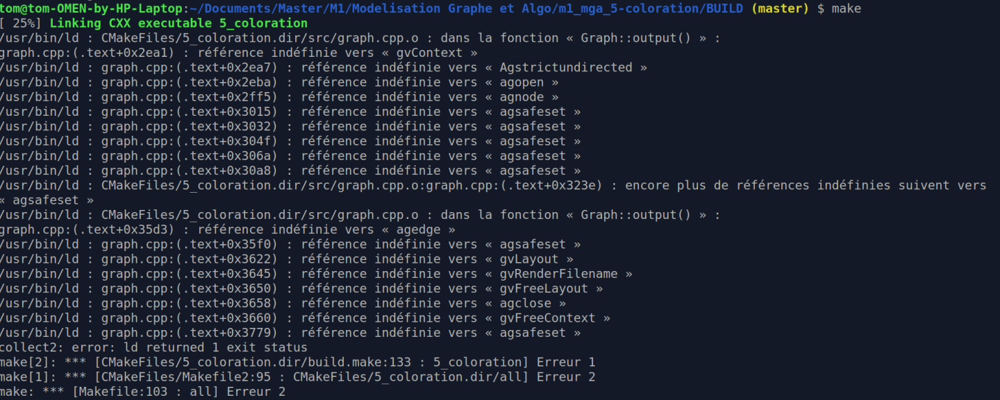
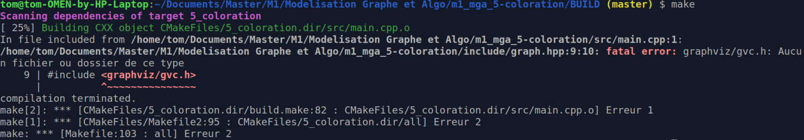

# Algorithme de 5 coloration

RIBARDIÈRE Tom, WALCAK Ladislas

## Le Compilation

Pour compiler ce projet, nous utilisons Cmake.

### Prérequis

Ce projet dépend des librairies *libgvc* et *libcgraph* (utilisées pour la création de la sortie graphique). Ces deux librairies sont fournies avec 
le package *graphviz* qui doit donc être installé au préalable.  

Si lors de la compilation, une erreur similaire à celle ci-dessous survient, c'est que une des deux librairies est manquantes.

Afin de résoudre ce problème, il vous suffit d'installer le package. Pour l'installer:
 - Ubuntu : `sudo apt install graphviz`
 - Archlinux : `sudo pacman -S graphviz`

**Note :**  
Sur Ubuntu, il est aussi possible qu'après l'installation du package *graphviz*, une erreur semblable à celle ci-dessous survient.

Pour y remédier, il vous faut installer le package *graphviz-dev* : `sudo apt install graphviz-dev`

### Compilation
Afin de compiler, voici les étapes à suivres :
1. Se placer à la racine du projet.
2. `mkdir BUILD && cd BUILD && cmake ..` permet de créer le makefile adapté.
2. `make` pour compiler le projet

### Lancement
Afin de lancer le programme, il vous est necessaire de fournir en premier argument le chemin vers le fichier .graphe correspondant.  
`./5_coloration [path_to_graphe]`  
À la fin de l'éxécution du programme, un fichier out.colors est créé à l'endroit où le programme à été lancé.  

Si vous souhaitez obtenir une sortie graphique du graphe, il vous faut pour cela reseigner en second argument le lien vers le
fichier .coords correspondant au graphe fourni.  
`./5_coloration [path_to_graphe] [parth_to_coords]`  
À la fin de l'éxécution du programme, en plus du fichier out.colors, un fichier out.png sera créé.

**Attention :**  
Aucune vérification n'est faite sur la validité des fichiers donnés par l'utilisateur. Dans le cas ou le graphe décrit serait incohérant
(eg: 0 à pour voisin 1 mais 1 n'a pas pour voisin 0), ou bien les coordonnées seraient invalides (eg: coordonnées < 1, points sans coordonnées, coordonnées 
d'un point non existant, ...), le programme pourrait ne pas donner une réponse correcte, ou bien même planter. C'est de la responsabilité de l'utilisateur 
de fournir des fichiers valides.

## Documentation

Vous trouverez toutes les informations nécessaires dans le [rapport de projet](Rapport.pdf).

De plus, un fichier Doxyfile est mis à disposition, permettant de générer la documentation technique avec l'outil *doxygen*  
`doxygen Doxyfile`  
La documentation sera générée dans un dossier *doc* se trouvant à l'endroit où la commande a été lancée.